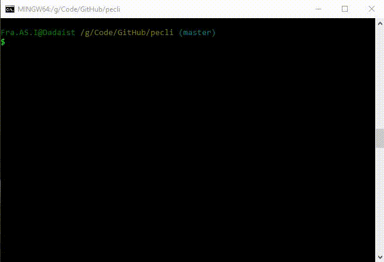

# pecli

### package.json explorer cli


```
$ npm install -g pecli
```


```
$ pecli --help

  node cli to inspect package.json

  Usage
        $ pecli

  How to
        Use arrow keys to navigate
        Press enter to open an url or run a script
        Esc or ctrl + c to exit program

  Note
        Package.json must be in the folder
        the command is run, otherwise
        throws a hissy fit

  Options
        --help, -h Show this help
        --version, -v Print out version number
```


